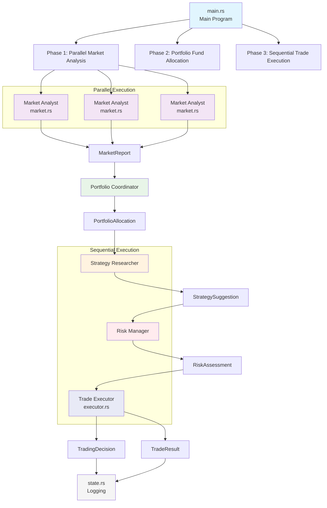

# Multi-Agent Cryptocurrency Auto Trading System

A multi-agent collaborative portfolio trading bot built with Rust, using DeepSeek LLM for decision making, and running on Binance testnet for automated cryptocurrency trading.

[English Version](README.md) | [中文版本](README_ZH.md)

## Core Features

- **Multi-Agent Architecture**: Market Analyst → Strategy Researcher → Risk Manager → Trade Executor → Portfolio Coordinator
- **Portfolio Management**: Support for multiple symbols with intelligent fund allocation
- **Professional Role Division**: Each agent specializes in specific domains, collaborative decision making
- **Contract Trading**: Support for long/short positions, automatic position switching
- **Technical Indicators**: SMA(5/20/50/100), Price Change Rate, ATR, Volume Ratio
- **Risk Control**: Position monitoring, P&L tracking, fund allocation, error retry

## System Architecture

### Multi-Agent Collaboration Process



### Agent Role Division

1. **Market Analyst** (`market.rs`)
   - Fetch K-line data, calculate technical indicators
   - Analyze market trends, strength, phases
   - Output: `MarketReport`

2. **Strategy Researcher**
   - Develop trading strategies based on market analysis
   - Suggest target positions, stop-loss, take-profit
   - Output: `StrategySuggestion`

3. **Risk Manager**
   - Assess trading risks, approve strategies
   - Calculate suggested trade quantities
   - Output: `RiskAssessment`

4. **Trade Executor** (`executor.rs`)
   - Make final decisions based on all inputs
   - Execute specific trading operations
   - Output: `TradingDecision`

5. **Portfolio Coordinator**
   - Manage fund allocation across multiple symbols
   - Develop portfolio strategies
   - Output: `PortfolioAllocation`

## Quick Start

### 1. Configure Environment

Copy environment template:
```bash
cp .env.example .env
```

Edit `.env` file with your information:

```bash
# Binance Testnet API (from https://testnet.binancefuture.com)
BINANCE_API_KEY=your_testnet_api_key
BINANCE_SECRET=your_testnet_secret
BINANCE_TESTNET=true

# DeepSeek API (from https://platform.deepseek.com)
DEEPSEEK_API_KEY=your_deepseek_key

# Trading Configuration
TRADE_SYMBOLS=BTCUSDT,ETHUSDT  # Multiple symbols, comma separated
MIN_TRADE_AMOUNT=0.001  # AI decision minimum trade quantity
MAX_TRADE_AMOUNT=0.003  # AI decision maximum trade quantity
TRADE_INTERVAL=1m  # Options: 1m, 15m, 30m, 1h
LEVERAGE=10  # Leverage: 1-125
MAX_POSITION=0.005  # Maximum position per symbol
PORTFOLIO_MODE=balanced  # Portfolio mode: balanced | aggressive | conservative
```

### 2. Build and Run

```bash
cargo build --release
cargo run --release
```

### 3. Check Logs

The program automatically creates `logs/` directory:

- `logs/trades.jsonl` - Trade records (open/close positions, prices, P&L)
- `logs/decisions.jsonl` - Decision records (including multi-agent analysis process)
- `logs/performance.json` - Performance tracking data

Each line is a JSON object, view with `jq`:

```bash
# View recent 10 trades
tail -10 logs/trades.jsonl | jq

# View all decisions
cat logs/decisions.jsonl | jq -c '{symbol: .symbol, signal: .decision.signal, reason: .decision.reason}'

# View performance data
cat logs/performance.json | jq
```

## Multi-Agent Decision Process

### Phase 1: Parallel Market Analysis

Each symbol executes in parallel:
1. **Fetch K-line Data**: 120 K-lines, calculate technical indicators
2. **Market Analyst Decision**: Analyze trends, strength, market phases
3. **Position Query**: Get current position status

### Phase 2: Portfolio Fund Allocation

1. **Portfolio Coordinator Allocation**: Allocate funds based on symbol analysis results
2. **Strategy Development**: Choose portfolio strategy based on configuration
   - `balanced`: Balanced allocation, moderate risk
   - `aggressive`: Concentrate on best symbols, pursue high returns
   - `conservative`: Diversified investment, control risk

### Phase 3: Sequential Trade Execution

Execute sequentially for each symbol:
1. **Strategy Researcher Suggestion**: Develop specific strategies based on market conditions
2. **Risk Manager Assessment**: Approve strategies, calculate suggested quantities
3. **Trade Executor Execution**: Make comprehensive decisions, execute trades

## Technical Indicators

System calculates the following technical indicators:

- **Moving Averages**: SMA5, SMA20, SMA50, SMA100
- **Price Change Rate**: 1-period, 3-period, 6-period, 12-period
- **ATR Indicator**: 14-period Average True Range
- **Volume Ratio**: Current volume / Average volume

## Risk Control

### Multi-layer Risk Protection

1. **Agent Collaboration**: Each decision reviewed by multiple professional roles
2. **Fund Allocation**: Portfolio coordinator allocates funds reasonably
3. **Trading Constraints**: Adhere to exchange minimum order quantity, minimum notional value rules
4. **Position Limits**: Maximum position control per symbol
5. **Error Handling**: Single failure doesn't affect overall operation

### Portfolio Strategies

- **Balanced Mode**: Equally allocate based on analysis quality
- **Aggressive Mode**: Concentrate funds on most promising symbols
- **Conservative Mode**: Strictly control single symbol risk exposure

## Risk Warning

⚠️ **Important Warnings**:

1. **For Learning and Research Only**: This project is for technical validation, not investment advice
2. **Testnet First**: Strongly recommend running on Binance testnet for several weeks first
3. **Fund Management**: Even on testnet, set reasonable trading parameters
4. **Monitor Operation**: Regularly check logs, observe decision quality
5. **LLM Limitations**: Large language models are not crystal balls, cannot predict the future

## FAQ

### How to Get Binance Testnet API?

**Important Update**: Binance testnet has migrated to Demo platform

1. Visit https://demo.binance.com
2. Login with GitHub or Google account (or register new account)
3. Go to Futures trading page
4. Click top-right avatar → API Management
5. Create new API Key (automatically get test funds)
6. Copy API Key and Secret to `.env` file

**Note**:
- Testnet REST API address: `https://testnet.binancefuture.com`
- Demo platform automatically provides virtual USDT for testing
- Testnet data syncs with mainnet in real-time, but trades don't affect real funds

### How to Get DeepSeek API?

1. Visit https://platform.deepseek.com
2. Register account and top up (first time gets free credits)
3. Create API key in API Keys page

### Program Error: `Missing BINANCE_API_KEY`

Check if `.env` file exists and is correctly configured.

### Program Error: `Failed to fetch K-line data`

1. Check network connection
2. Confirm Binance testnet is accessible
3. Check if rate limited (retry later)

### How to Modify Trading Interval?

Edit `TRADE_INTERVAL` in `.env` file:
- `1m` - 1 minute
- `15m` - 15 minutes
- `30m` - 30 minutes
- `1h` - 1 hour

### How to Add More Trading Pairs?

Edit `TRADE_SYMBOLS` in `.env` file, separate multiple pairs with commas:
```bash
TRADE_SYMBOLS=BTCUSDT,ETHUSDT,SOLUSDT,ADAUSDT
```

## Code Statistics

```
Total: 1000+ lines
├── main.rs          300+ lines (Main program + Portfolio coordination)
├── executor.rs      267 lines (Trade execution + HMAC signing)
├── multi_agent.rs   200+ lines (Multi-agent collaboration logic)
├── llm.rs          179 lines (DeepSeek API + Prompts)
├── market.rs       118 lines (Binance API + Indicator calculation)
├── types.rs         81 lines (Data structure definitions)
├── state.rs         55 lines (Logging)
├── logging.rs       40 lines (Logging system)
└── performance.rs   30 lines (Performance tracking)
```

## Tech Stack

- **Rust** 1.83+ (edition 2021)
- **async-openai** - DeepSeek API client
- **reqwest** - HTTP requests
- **tokio** - Async runtime
- **serde/serde_json** - JSON serialization
- **hmac/sha2** - Binance API signing
- **anyhow** - Error handling
- **chrono** - Time handling
- **futures** - Async programming
- **log/flexi_logger** - Logging system

## License

MIT
