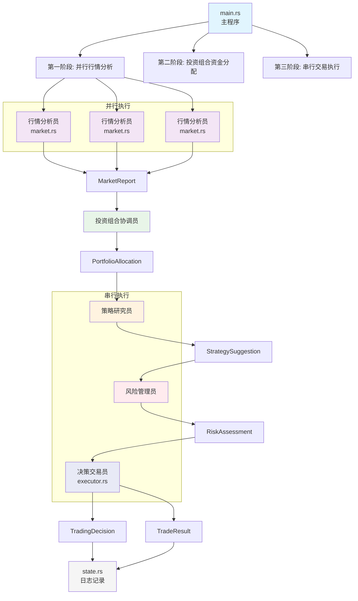

# 多智能体加密货币自动交易系统

基于 DeepSeek 的多智能体协作投资组合交易机器人，使用 Rust 实现，在 Binance 测试网上对多个加密货币进行自动交易。

[English Version](README.md) | [中文版本](README_ZH.md)

## 核心特性

- **多智能体架构**：行情分析员 → 策略研究员 → 风险管理员 → 决策交易员 → 投资组合协调员
- **投资组合管理**：支持多标的并行交易，智能资金分配
- **专业角色分工**：每个智能体专注特定领域，协同决策
- **合约交易**：支持做多/做空，自动处理多空切换
- **技术指标**：SMA(5/20/50/100)、价格变化率、ATR、成交量比
- **风险控制**：持仓监控、盈亏跟踪、资金分配、错误重试

## 系统架构

### 多智能体协作流程



### 智能体角色分工

1. **行情分析员** (`market.rs`)
   - 获取K线数据，计算技术指标
   - 分析市场趋势、强度、阶段
   - 输出：`MarketReport`

2. **策略研究员**
   - 基于行情分析制定交易策略
   - 建议目标仓位、止损止盈
   - 输出：`StrategySuggestion`

3. **风险管理员**
   - 评估交易风险，审批策略
   - 计算建议交易数量
   - 输出：`RiskAssessment`

4. **决策交易员** (`executor.rs`)
   - 综合各方意见做出最终决策
   - 执行具体交易操作
   - 输出：`TradingDecision`

5. **投资组合协调员**
   - 管理多标的资金分配
   - 制定投资组合策略
   - 输出：`PortfolioAllocation`

## 快速开始

### 1. 配置环境

复制环境变量模板：
```bash
cp .env.example .env
```

编辑 `.env` 文件，填入以下信息：

```bash
# Binance 测试网 API (从 https://testnet.binancefuture.com 获取)
BINANCE_API_KEY=your_testnet_api_key
BINANCE_SECRET=your_testnet_secret
BINANCE_TESTNET=true

# DeepSeek API (从 https://platform.deepseek.com 获取)
DEEPSEEK_API_KEY=your_deepseek_key

# 交易配置
TRADE_SYMBOLS=BTCUSDT,ETHUSDT  # 多标的交易，逗号分隔
MIN_TRADE_AMOUNT=0.001  # AI决策最小交易数量
MAX_TRADE_AMOUNT=0.003  # AI决策最大交易数量
TRADE_INTERVAL=1m  # 可选: 1m, 15m, 30m, 1h
LEVERAGE=10  # 杠杆倍数: 1-125
MAX_POSITION=0.005  # 每个标的最大持仓量
PORTFOLIO_MODE=balanced  # 投资组合模式: balanced(均衡) | aggressive(激进) | conservative(保守)
```

### 2. 编译运行

```bash
cargo build --release
cargo run --release
```

### 3. 查看日志

程序会自动创建 `logs/` 目录：

- `logs/trades.jsonl` - 交易记录（开仓/平仓/价格/盈亏）
- `logs/decisions.jsonl` - 决策记录（包含多智能体分析过程）
- `logs/performance.json` - 性能跟踪数据

每行一个 JSON 对象，可用 `jq` 查看：

```bash
# 查看最近10条交易
tail -10 logs/trades.jsonl | jq

# 查看所有决策
cat logs/decisions.jsonl | jq -c '{symbol: .symbol, signal: .decision.signal, reason: .decision.reason}'

# 查看性能数据
cat logs/performance.json | jq
```

## 多智能体决策流程

### 第一阶段：并行行情分析

每个标的并行执行：
1. **获取K线数据**：120根K线，计算技术指标
2. **行情分析员决策**：分析趋势、强度、市场阶段
3. **持仓查询**：获取当前持仓状态

### 第二阶段：投资组合资金分配

1. **组合协调员分配**：基于各标的分析结果分配资金
2. **策略制定**：根据配置选择投资组合策略
   - `balanced`：均衡分配，风险适中
   - `aggressive`：集中优势标的，追求高收益
   - `conservative`：分散投资，控制风险

### 第三阶段：串行交易执行

对每个标的顺序执行：
1. **策略研究员建议**：基于行情制定具体策略
2. **风险管理员评估**：审批策略，计算建议数量
3. **决策交易员执行**：综合决策，执行交易

## 技术指标

系统计算以下技术指标：

- **移动平均线**：SMA5、SMA20、SMA50、SMA100
- **价格变化率**：1周期、3周期、6周期、12周期
- **ATR指标**：14周期平均真实波幅
- **成交量比**：当前成交量/平均成交量

## 风险控制

### 多层风险防护

1. **智能体协作**：每个决策经过多个专业角色审核
2. **资金分配**：投资组合协调员合理分配资金
3. **交易约束**：遵守交易所最小下单量、最小名义价值等规则
4. **持仓限制**：每个标的最大持仓量控制
5. **错误处理**：单次失败不影响整体运行

### 投资组合策略

- **均衡模式**：各标的按分析质量均衡分配
- **激进模式**：集中资金到最有潜力的标的
- **保守模式**：严格控制单标的风险敞口

## 风险提示

⚠️ **重要警告**：

1. **仅供学习研究**：本项目用于技术验证，不构成投资建议
2. **测试网优先**：强烈建议先在 Binance 测试网运行数周
3. **资金管理**：即使测试网，也应设置合理的交易参数
4. **监控运行**：定期检查日志，观察决策质量
5. **LLM 局限性**：大语言模型不是水晶球，无法预测未来

## 常见问题

### 如何获取 Binance 测试网 API？

**重要更新**：Binance 测试网已迁移到 Demo 平台

1. 访问 https://demo.binance.com
2. 使用 GitHub 或 Google 账号登录（或注册新账号）
3. 进入 Futures 交易页面
4. 点击右上角头像 → API Management
5. 创建新的 API Key（自动获得测试资金）
6. 复制 API Key 和 Secret 到 `.env` 文件

**注意**：
- 测试网 REST API 地址：`https://testnet.binancefuture.com`
- Demo 平台会自动提供虚拟 USDT 用于测试
- 测试网数据与主网实时同步，但交易不影响真实资金

### 如何获取 DeepSeek API？

1. 访问 https://platform.deepseek.com
2. 注册账号并充值（首次赠送免费额度）
3. 在 API Keys 页面创建密钥

### 程序报错：`缺少 BINANCE_API_KEY`

检查 `.env` 文件是否存在且正确配置。

### 程序报错：`获取K线数据失败`

1. 检查网络连接
2. 确认 Binance 测试网是否可访问
3. 查看是否被限流（稍后重试）

### 如何修改交易周期？

编辑 `.env` 文件中的 `TRADE_INTERVAL`：
- `1m` - 1分钟
- `15m` - 15分钟
- `30m` - 30分钟
- `1h` - 1小时

### 如何添加更多交易对？

编辑 `.env` 文件中的 `TRADE_SYMBOLS`，用逗号分隔多个交易对：
```bash
TRADE_SYMBOLS=BTCUSDT,ETHUSDT,SOLUSDT,ADAUSDT
```

## 代码统计

```
总计: 1000+ 行
├── main.rs          300+行 (主程序+投资组合协调)
├── executor.rs      267行 (交易执行+HMAC签名)
├── multi_agent.rs   200+行 (多智能体协作逻辑)
├── llm.rs          179行 (DeepSeek API+提示词)
├── market.rs       118行 (Binance API+指标计算)
├── types.rs         81行 (数据结构定义)
├── state.rs         55行 (日志记录)
├── logging.rs       40行 (日志系统)
└── performance.rs   30行 (性能跟踪)
```

## 技术栈

- **Rust** 1.83+ (edition 2021)
- **async-openai** - DeepSeek API 客户端
- **reqwest** - HTTP 请求
- **tokio** - 异步运行时
- **serde/serde_json** - JSON 序列化
- **hmac/sha2** - Binance API 签名
- **anyhow** - 错误处理
- **chrono** - 时间处理
- **futures** - 异步编程
- **log/flexi_logger** - 日志系统

## License

MIT
